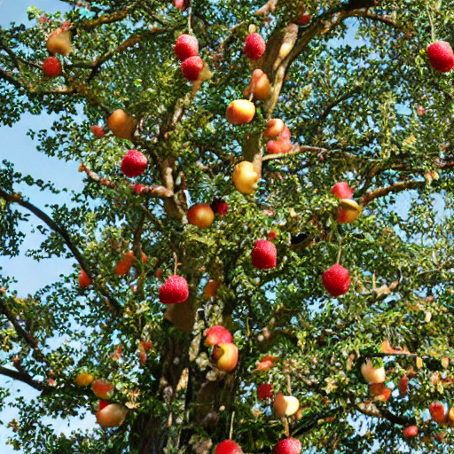
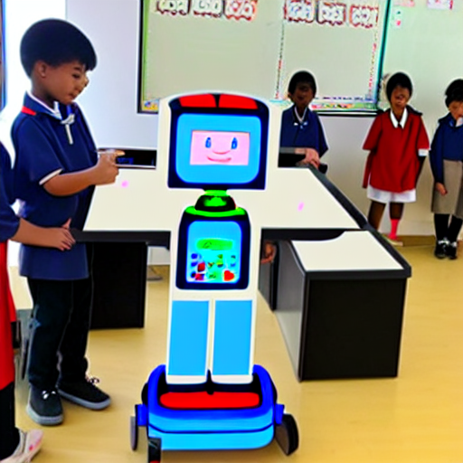

# Stable-Diffusion-Image-Generator
This project demonstrates how to generate images from textual descriptions using a pre-trained Stable Diffusion model. The implementation is done in Python using PyTorch and the Hugging Face diffusers library, focusing on generating high-quality images based on user-provided descriptions.

## Project Overview
The Stable Diffusion Image Generator is designed to convert textual descriptions into visually appealing images using the powerful Stable Diffusion model. This project is ideal for creative professionals, hobbyists, and researchers interested in exploring the capabilities of generative models in art and design.

## Features
Text-to-Image Generation: Converts textual descriptions into images.
Pre-Trained Model: Utilizes the pre-trained Stable Diffusion model (v1-4) for generating images.
GPU Acceleration: Leverages CUDA-compatible GPUs for faster inference and image generation.
Customization: Allows customization of hyperparameters such as guidance scale and the number of inference steps to fine-tune the quality of the generated images.

## How It Works
Loading the Model: The project uses the Stable Diffusion model, which is pre-trained on a large dataset of images and text pairs. This model is loaded and configured to run on a GPU for enhanced performance.

### Image Generation: 
Users provide a textual description of the desired image. The model then processes this description and generates a corresponding image.

### Saving and Displaying Images: 
The generated images are automatically saved and can be viewed directly. These images are stored in a specified directory for later use or sharing.

## Usage
To use this project, simply provide a description of the image you want to generate. The model will process the description and output a corresponding image, which will be saved and displayed.

### Example
If you input a description such as "Trees with fruits on them," the model will generate an image depicting trees bearing fruit. 

## Customization
The project includes several hyperparameters that can be adjusted to influence the image generation process:

Guidance Scale: Adjusts how closely the image matches the provided description.
Number of Inference Steps: Controls the quality and detail of the generated image by determining the number of denoising steps.
Random Seed: Ensures reproducibility of the generated images by setting a specific random seed.
Real-World Example
When I first provided the text "Mechanical robot with screen teaching students," the image generated was decent but had some noise, such as slight blurring and lack of clarity. 
.png)

To improve this, I adjusted the guidance scale to 20, resulting in a much clearer image that adhered closely to the description.

However, the initial text led to an image that included a mechanical robot, a screen, and students separately, rather than a robot with a screen teaching students because guidance scale assures that the image strictly sticks to the text. To refine the outcome, I modified the text to "A programmed humanoid robot having a screen teaching the primary school students in India" and adjusted the guidance scale to 18. This resulted in the desired clear image that perfectly matched the text description.
.png)

## Installation
Clone the Repository: Download the project files from GitHub.
Install Dependencies: Install the necessary Python libraries, including PyTorch, Transformers, and Diffusers.
Run the Notebook: Open and run the provided Jupyter Notebook file to generate images based on your descriptions.
Generated Images
The repository includes a collection of sample images generated using the model. These images serve as examples of what the model can produce from different textual descriptions.

## Acknowledgments
This project makes use of the Stable Diffusion model developed by CompVis, along with the diffusers library from Hugging Face. These tools enable efficient and high-quality image generation from text.
